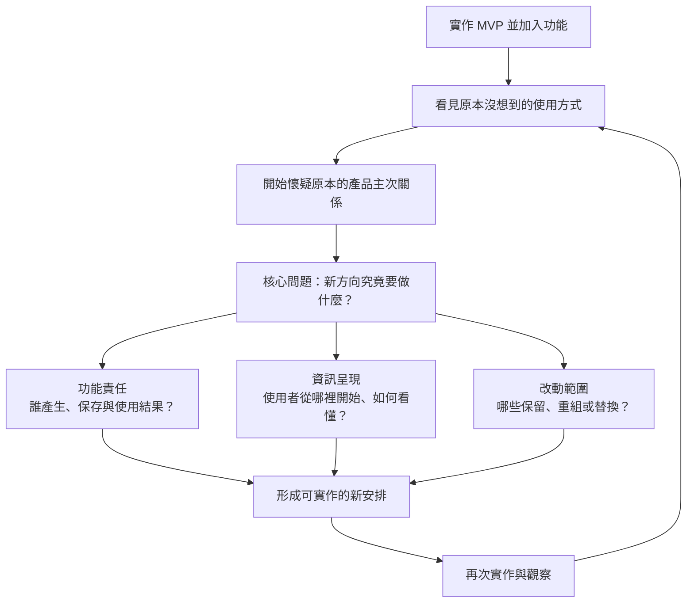
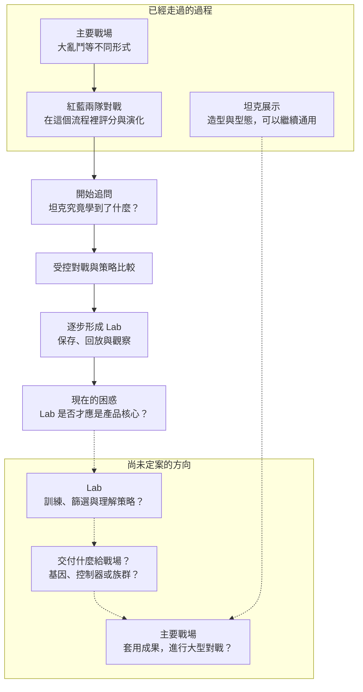

# Architecture Pivot：做著做著，重新理解了想做的產品

在完成 MVP 的過程中，新增功能帶來新的理解，也讓原本的架構與資訊呈現開始需要重新考慮。

這是一份留給自己回看的開發紀錄：當時遇到了什麼、為什麼困惑，以及哪些問題還沒想清楚。它延續了我的 [GitHub 索引](https://github.com/WilliamCHIU-ETH/WilliamCHIU-ETH)裡「保留困惑與學習過程」的意圖。目前沒有成熟解法，也還沒有決定要重寫多少。

記錄日期：2026-09-09

## 當時遇到了什麼

我原本正在完成第一階段 MVP。過程中逐步加入模組與功能，希望把原先構想做完整；但新增的能力，也讓我看見原本沒有想到的使用方式。

某個原本輔助性的功能，開始顯得更接近產品的核心。於是，我需要重新思考哪些功能應該放在中心、哪些適合當成工具或展示，以及它們之間應該交換什麼。

我用下面這段話記住這次的問題：

> 實作帶來的新理解，改變了我對產品核心與功能分工的判斷；既有架構與畫面仍然承載著早期的想法，而新的安排還沒有想清楚。

這種 Architecture Pivot 可能牽動很大的範圍。不過，在 AI 協助下，我對實作與迭代的負擔感，比以前小了。眼前最難的部分，是把新方向想清楚到足以實作。

## 困惑可以拆成哪些部分

### 1. 新功能，還是新的產品核心？

新增一項功能，通常可以沿用既有產品的主次關係。但如果做完之後發現「它可能才是整個產品最值得圍繞的地方」，就需要重新理解原本的功能安排。

我還需要分辨：這個發現真的改變了產品核心，還是我剛好對新做出來的東西特別有興趣？

### 2. 功能都有了，但彼此的責任還不清楚

展示、實驗、訓練、比較與對戰，可以各自成立。當它們放進同一個產品時，誰負責產生結果、誰負責保存、誰負責播放與解釋，就會影響整體流程。

一旦主次關係改變，原本方便的模組切法與資料流，也可能需要重新安排。

### 3. 架構改了，使用者要怎麼理解產品？

功能分工會反映在畫面上：使用者先進到哪裡、先看到什麼、按下按鈕後發生什麼，以及如何理解眼前的結果。

如果仍然沿用舊入口與舊資訊層級，就可能出現「程式已有新能力，但整個產品仍在說舊故事」的情況。

### 4. 舊成果要保留多少，新方向又確定了多少？

我已經完成一些可用的東西，也知道新的想法可能更合理。但目前還不能直接判定哪些應該保留、重新分工或替換，更不能由改動看起來很大，就推論需要全部重寫。

這張圖是我整理問題的方式；目前仍停留在釐清新安排的階段。

## 為什麼會發生

**有些需求要看見東西後才想得出來。** 透過初步實作，才能體會某種操作、比較或回放到底能幫上什麼忙。Mike Cohn 的實務文章也指出，一部分需求會在產品逐漸成形後才浮現，不能一概歸因於前期沒有想周全。[參考文章](https://www.mountaingoatsoftware.com/agile/the-three-types-of-requirements)

**新工具也會改變我工作的方式。** 當原本難以觀察的策略變得可以並排比較，我開始提出以前不容易提出的問題。Sommerville 的需求變化討論也涵蓋這類情況：系統導入後，新的工作方式可能帶來新的需求。[參考資料](https://software-engineering-book.com/web/changing-requirements/)

**原本的架構保存了當時的理解。** 在這次案例中，我先把對戰、演化與觀看放在同一個主要流程；後來發現它們也許需要不同的操作方式。新的理解與舊結構之間，因此出現落差。這是對自己案例的解讀，還不能據此判定整套架構都不適用。

**AI 讓我更願意嘗試，但新想法仍需要消化。** 我可以更快做出東西，也更快遇到下一個值得追問的問題。這次的感受是：實作進展很快，對產品的理解卻還需要來回確認。這是個人經驗，沒有量測能證明 AI 在所有類似專案中的效果。

## 一個值得記住的風險：Second System Effect

Second System Effect（第二系統效應）描述一種風險：有了第一套系統的經驗後，設計下一套時容易想把之前沒做、現在想到的功能與改善一次放進去，導致過度設計。

這個概念出自 Fred Brooks 的《The Mythical Man-Month》第五章，也有人在業界實務寫作中沿用。例如 Marton Trencseni 以自己使用 Hack／HHVM 的經驗與閱讀，討論這個風險；這能確認它有實務用例，不代表已有使用率統計。[實務文章](https://bytepawn.com/hack-hhvm-second-system-effect.html)

對我而言，值得留下的問題是：

> 我正在重新安排已經理解的需求，還是想把這段時間累積的所有新點子，都塞進下一版？

目前有新的方向與較大的改動想像，還不足以判定自己已經陷入第二系統效應。它先作為提醒保留。

## 我的案例：Tank Lab

最初，我逐步做了坦克展示與主要戰場。戰場經歷過大亂鬥等不同形式，後來改成紅藍兩隊對戰，並在這個流程中迭代基因演算法。

接著，我開始追問：坦克究竟學到了什麼？為了更容易觀察策略差異，我做了受控對戰與比較，並逐步加入保存、回放，形成了 Lab。

原本只是為了研究與觀看方便而做的工具，讓我開始覺得：也許 Lab 更適合成為訓練、比較與理解策略的主要場所；大型戰場則載入產出的策略，讓兩批坦克對打。

這是目前正在形成的想法。既有 Lab 的保存與回放能力，不等於它已經是完整的訓練入口，也還沒有證據可以宣稱這種安排會帶來更好的演化效果。

虛線與問號保留尚未決定的關係；坦克展示可以通用，也不代表它已經接好所有候選流程。

我目前還沒想清楚的，是 Lab 與戰場各自負責到哪裡、兩者之間交換什麼，以及使用者要如何從畫面理解這個關係。這份紀錄先停在這裡，保留當時的困惑，讓下一次回頭看時能接續思考。
